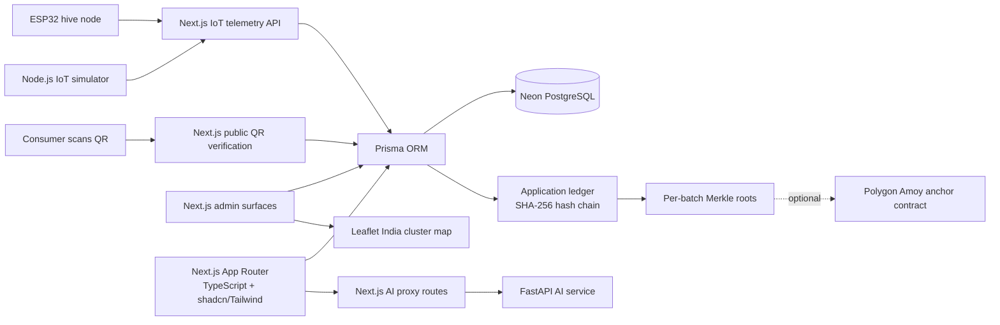

# Honey Chain

Honey Chain is a Next.js and Prisma platform for traceable honey, smart hive
management, AI-assisted colony insights, and consumer verification. It is
designed for the KVIC Honey Mission and the Smart India Hackathon 2026:
beekeepers and administrators get practical field visibility, while consumers
can verify a bottle's journey from hive to home.

## Problem

The KVIC Honey Mission supports beekeepers who face counterfeit honey,
fragmented records, weak traceability, difficult market linkage, and limited
hive-management data. Consumers cannot easily distinguish genuine honey from
adulterated or misrepresented products. Cluster officers need a view across
apiaries, health alerts, yields, lab results, and supply-chain hand-offs.

## Solution

Honey Chain combines:

- An application-layer SHA-256 hash-chain ledger and per-batch Merkle roots.
- Optional Polygon Amoy anchoring for a Merkle root and PolygonScan proof.
- AI proxy routes backed by the separate FastAPI service, with deterministic
  fallbacks when the service is unavailable.
- IoT telemetry from ESP32 hardware or the Node.js simulator.
- QR units that open public, signed consumer verification pages.
- KVIC/admin cluster tables, a Leaflet India map, onboarding, integrations
  stubs, and an IndexedDB offline outbox.

## Key features

- Dashboard with hive totals, alert summaries, yield outlook, and AI insights.
- Hive telemetry charts, polling, anomaly signals, and diagnosis flow.
- Supply-chain stages for harvest, collection, lab, processing, bottling, and QR.
- Tamper demonstration with chain verification and Merkle proof data.
- Public QR verification with beekeeper, lab, processing, hive conditions, and
  optional Polygon Amoy transaction proof.
- Admin cluster aggregates, CSV onboarding, responsive map, and demo integrations.
- Role-aware navigation using the existing cookie role mechanism.
- Optional on-chain anchoring that is completely hidden when not configured.

## Architecture



The public-chain component is optional. PostgreSQL remains the source of truth
for application data, blocks, hashes, and Merkle roots.

## Setup: five primary commands

Run these in PowerShell from the repository root. Copy `.env.example` to `.env`
and set `DATABASE_URL`, `QR_SECRET`, and other local values before the seed
command. `npm run seed:demo` is destructive and is intended only for a local
demo database.

```powershell
Copy-Item .env.example .env
npm install
npx prisma generate
npm run seed:demo
npm run dev
```

Open `http://localhost:3000`. The seed command resets the database named by the
current `DATABASE_URL`; it does not change that variable or select a database
for you.

## Demo credentials

The seed creates records with `passwordHash: "demo-password"`. The current
application uses a simple role cookie rather than a login library, so these
are seeded identity records for the demo rather than a separate login system.

| Name | Phone | Role | Password value in seed |
| --- | --- | --- | --- |
| Harpreet Singh | `+91980000001` | BEEKEEPER | `demo-password` |
| Punjab Honey Quality Lab | `+91980000101` | LAB | `demo-password` |
| Honey Valley Processing Unit | `+91980000102` | PROCESSOR | `demo-password` |
| KVIC Regional Officer | `+91980000103` | KVIC_OFFICER | `demo-password` |

The seed also creates seven additional beekeepers with phones
`+91980000002` through `+91980000008`, all with the same seeded password value.

## Hardware BOM

The following components are documented by the project. Costs are approximate
demo estimates and vary by supplier.

| Component | Purpose | Approx. cost |
| --- | --- | ---: |
| ESP32 DevKit V1 | Wi-Fi edge controller | INR 450 |
| DHT22 | Temperature and humidity | INR 350 |
| HX711 + 20 kg load cell | Hive weight measurement | INR 570 |
| MAX9814 microphone | Colony acoustic signal | INR 300 |
| MH-Z19B CO2 sensor | Ventilation and CO2 monitoring | INR 1,650 |
| 20 W solar panel + charge controller | Off-grid power | INR 1,400 |
| 18650 battery + holder | Energy storage | INR 500 |
| LoRa fallback radio pair | Long-range fallback when Wi-Fi is unavailable | INR 1,000 |
| Enclosure, wires, connectors | Weather protection and assembly | INR 600 |

The simulator sends the same payload shape to `/api/iot/telemetry` as the
hardware. Run it with `npm run iot:simulate` when a physical node is not
available.

## API reference

| Method | Route | Purpose |
| --- | --- | --- |
| GET | `/api/health` | Application health check. |
| GET | `/api/ledger` | Lists batches, blocks, verification status, and anchoring availability. |
| POST | `/api/ledger/[batchId]/anchor` | Anchors a valid batch Merkle root to Polygon Amoy when configured. |
| POST | `/api/demo/tamper` | Mutates a demo block for the tamper demonstration. |
| POST | `/api/demo/restore` | Restores a demo chain after tampering. |
| GET, POST | `/api/batches` | Lists batches or records a harvest and first ledger block. |
| GET | `/api/batches/[id]` | Loads a batch and verifies its chain. |
| POST | `/api/batches/[id]/collect` | Records the collection-centre stage. |
| POST | `/api/batches/[id]/lab` | Adds a lab result and ledger event. |
| POST | `/api/batches/[id]/process` | Adds a processing event and ledger event. |
| POST | `/api/batches/[id]/qr` | Assigns deterministic signed QR units. |
| GET, POST | `/api/hives` | Lists hives. |
| GET | `/api/hives/[id]` | Loads hive telemetry and alerts. |
| POST | `/api/iot/telemetry` | Validates device telemetry and creates threshold alerts. |
| POST | `/api/ai/anomaly` | Proxies anomaly detection to the AI service or fallback. |
| POST | `/api/ai/colony-health` | Proxies colony health prediction to the AI service or fallback. |
| POST | `/api/ai/disease` | Proxies disease analysis to the AI service or fallback. |
| POST | `/api/ai/yield` | Proxies yield prediction to the AI service or fallback. |
| GET, POST | `/api/admin/clusters` | Lists cluster aggregates or validates and onboards CSV data. |
| GET | `/verify/[batchId]` | Public signed QR verification page for a QR unit code. |

## Optional Polygon Amoy anchoring

Polygon Amoy is optional. The normal PostgreSQL ledger, QR verification,
dashboard, AI, IoT, and admin flows work without it. When `POLYGON_PRIVATE_KEY`
is unset, the `/ledger` anchor button remains hidden.

To enable it for a funded test wallet:

1. Set `POLYGON_AMOY_RPC_URL`, `POLYGON_PRIVATE_KEY`, and
   `HONEY_CHAIN_ANCHOR_CONTRACT_ADDRESS` in the server environment.
2. Deploy with `npm run deploy:anchor:amoy`.
3. Use **Anchor to blockchain** on `/ledger`.

The private key is server-only and must never be placed in a `NEXT_PUBLIC_*`
variable or committed to Git. A successful anchor saves `anchorTxHash` on the
final application ledger block. The public verification page then shows a
PolygonScan Amoy link.

## Deployment and demo notes

- Deploy the Next.js app to Vercel with server environment variables configured.
- Deploy the FastAPI service separately and set `AI_SERVICE_URL`.
- Use the deployed Vercel URL when generating QR links for a live demo.
- Use `npm run seed:demo` only against a disposable local demo database.
- The application ledger is the primary integrity mechanism; Polygon Amoy is
  an optional external proof, not the primary database.
- See [`DEMO.md`](./DEMO.md) for the five-minute presentation path.
